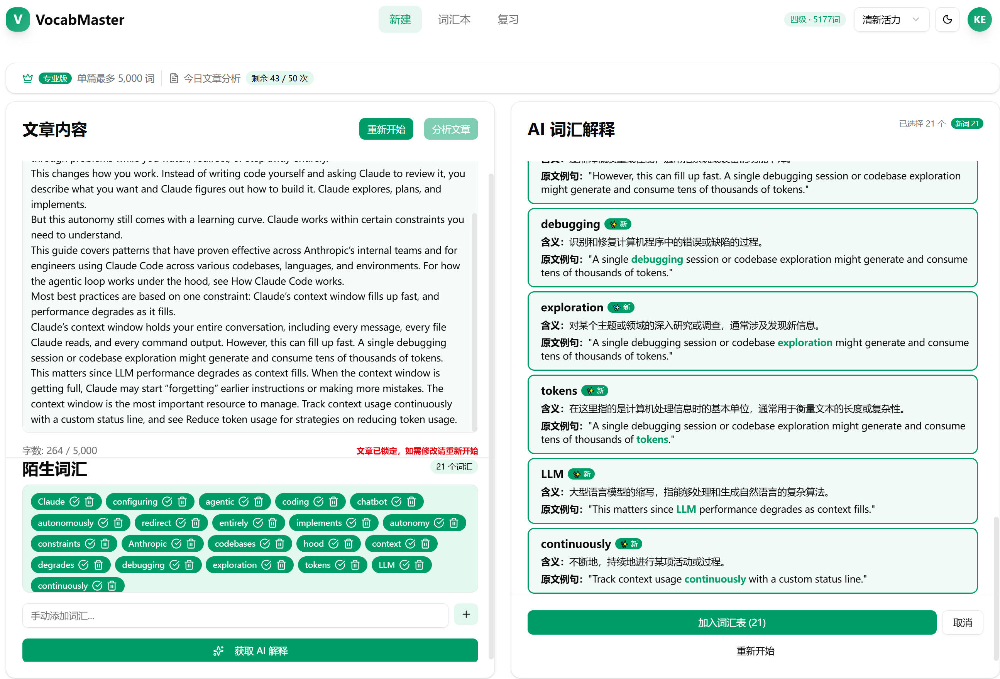
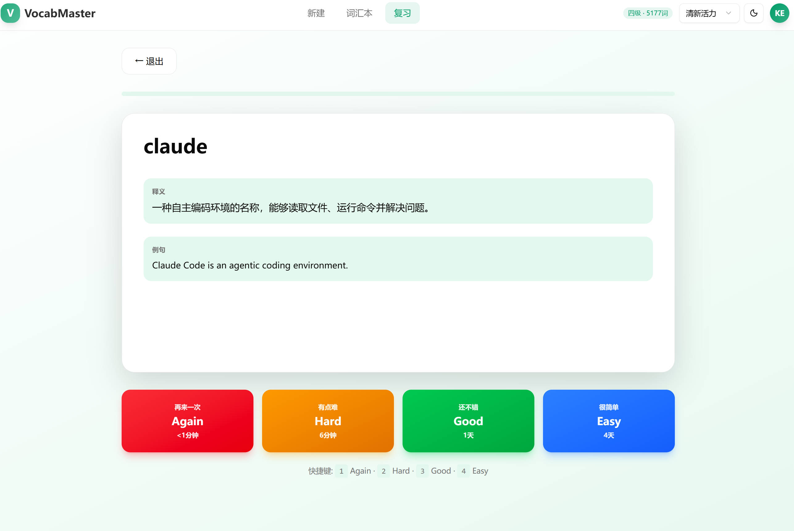
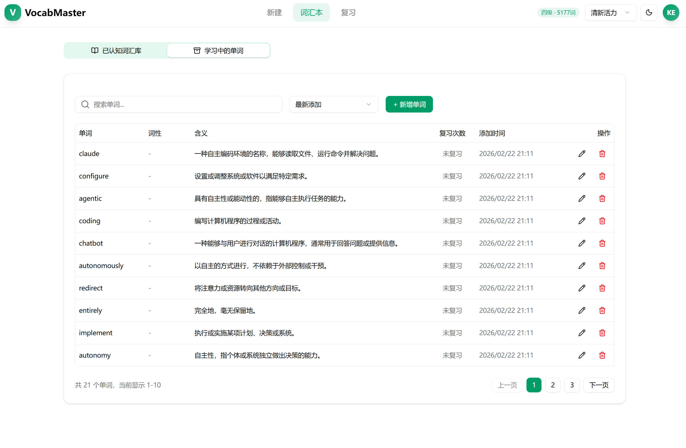
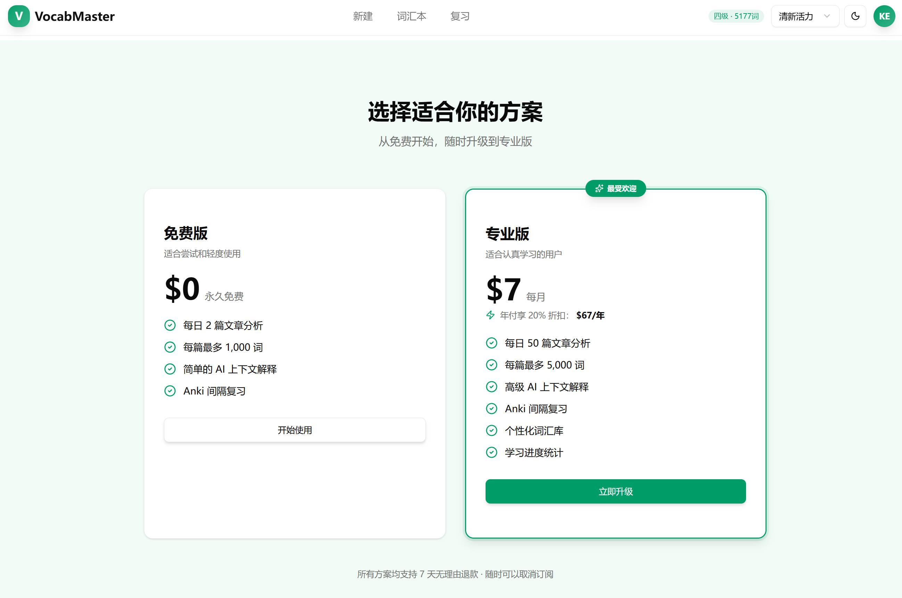

# Vocab Master

**AI-powered vocabulary learning from real English articles.**

Paste any article → AI identifies words you don't know and explains them in context → Review with spaced repetition until they stick.

---

🔗 **Live Demo:** _coming soon_ · [中文文档](./README_CN.md)

---

## Screenshots

<table>
  <tr>
    <td></td>
    <td></td>
  </tr>
</table>

---

## ✨ Highlights

- **Dual AI pipeline** — Google Cloud NLP tokenizes the article and extracts word lemmas; GPT-4o-mini explains each unfamiliar word based on how it's used in *this* article, not a generic dictionary definition
- **Three-type word classification** — `New` (first time seen), `Extend` (known word, new meaning in context), `Mastered` (AI determines you already know this usage — skipped and not saved)
- **Anki SM-2 spaced repetition** — saved words enter a flashcard queue; four difficulty ratings (Again / Hard / Good / Easy) dynamically compute the next review date

---

## The Problem

When reading English articles, you often hit a word you *sort of* know — but the dictionary definition doesn't fit the context. Querying an AI tool works, but it breaks your reading flow.

Vocab Master fixes this: it reads the article for you, filters out words you already know (based on your proficiency level), and has AI explain only the truly unfamiliar ones — in context.

---

## How It Works

1. **Set your level** — choose from 7 proficiency tiers (Middle School → GRE). The system pre-filters words you already know.
2. **Paste an article** — Google NLP tokenizes the text; GPT-4o-mini explains unfamiliar words based on how they're used in *this* article, not just generic definitions.
3. **Review with flashcards** — saved words enter an Anki SM-2 spaced repetition queue. Four difficulty ratings (Again / Hard / Good / Easy) dynamically adjust your next review date.

---

## Features

- **Known-word whitelist** — manually mark domain terms (e.g. tech jargon) so they're always filtered out
- **Auth** — email + phone number sign-up/login with verification, powered by Better Auth
- **Subscriptions** — Stripe-powered freemium with monthly/yearly plans and webhook-driven lifecycle management
- **Usage quotas** — middleware-level enforcement with real-time display and upgrade prompts
- **Learning stats** — daily new words, review count, accuracy rate, streaks

---

## Tech Stack

| | |
|---|---|
| **Backend** | Hono.js on Cloudflare Workers |
| **Database** | PostgreSQL (Neon) via HTTP + Drizzle ORM |
| **Auth** | Better Auth (email + phone) |
| **AI / NLP** | OpenAI GPT-4o-mini + Google Cloud NLP |
| **Payments** | Stripe (subscriptions + webhooks) |
| **Frontend** | React 19, React Router v7, TanStack Query, Radix UI |
| **Validation** | Zod (end-to-end, shared between client and server) |
| **Monorepo** | pnpm workspaces (`api` / `client` / `shared`) |

---

## Subscription Tiers

| | Free | Premium |
|--|:----:|:-------:|
| Articles / day | 2 | 50 |
| Max words / article | 1,000 | 5,000 |
| Flashcard review | ✓ | ✓ |
| Price | $0 | $7 / mo · $67 / yr |

---

## License

MIT
